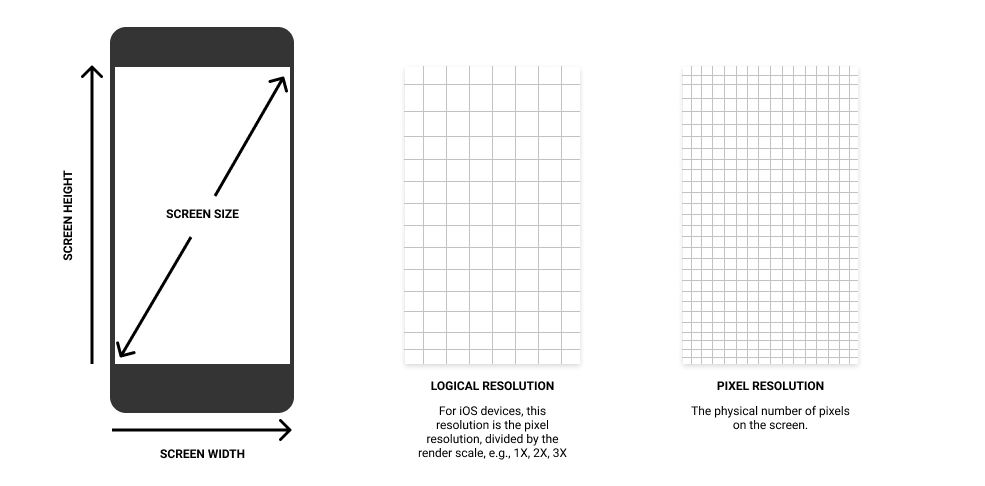

# Device Sizes

This package aggregates screen sizes and pixel densities for as many physical devices as possible. The purpose of this package is to help developers make decisions in their code based on common device form factors.

Here are some examples of how device sizes might be used:

 * Choosing dimensions for golden tests
 * Choosing layout breakpoints for your app layout
 * Implementing graphics programs where the user might want a canvas the size of a typical device
 
To report bugs, add more device sizes, or request new features, please see [CONTRIBUTING.md](CONTRIBUTING.md).
 